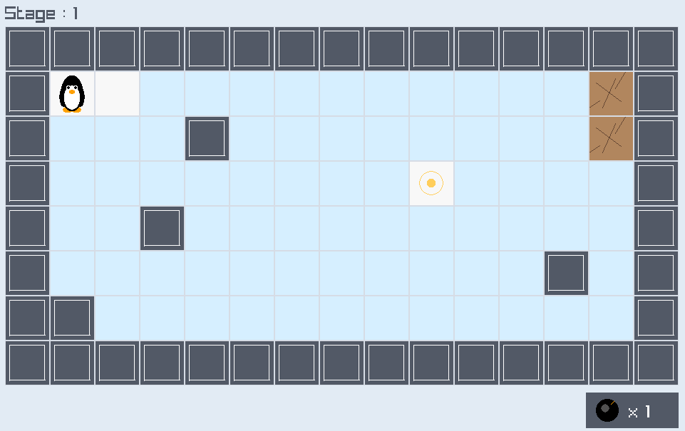
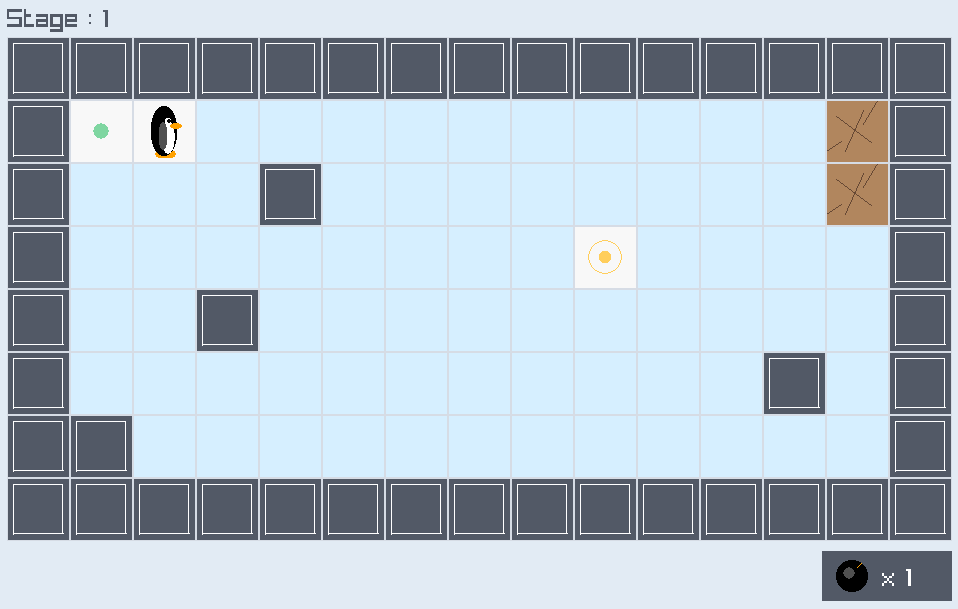
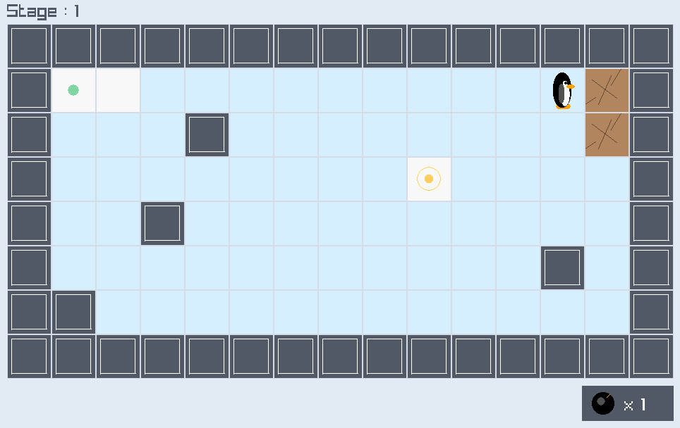

# CrossyIce

A GUI-based modified Ice Sliding Puzzle game built with **F# / .NET 10** and **Raylib_cs**.

In CrossyIce, the player controls a character on a top-down grid map. The goal is to reach the destination tile by moving across dry land, sliding over ice, and using a limited number of bombs to destroy cracked obstacles.

---

## Getting Started

### Prerequisites

- [GIT](https://git-scm.com/install)   
  Verify with: `git --version` 
- [.NET 10 SDK](https://dotnet.microsoft.com/download)  
  Verify with: `dotnet --version` (should show `10.x.x`)

### Run

#### Run by downloading the code
```
git clone https://github.com/leehyunseo03/CrossyIce.git
cd CrossyIce
```
Then run the project based on your operating system : 
```bash
# Windows
run.bat

# Unix / macOS
chmod +x run.sh
./run.sh

# Or directly
dotnet run
``` 

#### Run by executing the file
- **Only for Windows & Unix!**
1. Open the **Releases** Tab of this repository
2. Download the latest release for your opeating system
3. unzip the downloaded file
4. Execute the program
```bash
# Windows
CrossyIce.exe

# Unix
chmod +x CrossyIce
./CrossyIce
```

### Build
```bash
dotnet build
```

### Publish Self-Contained Binary

```bash
# Windows x64
dotnet publish -c Release -r win-x64 --self-contained true -o publish/win-x64

# Linux x64
dotnet publish -c Release -r linux-x64 --self-contained true -o publish/linux-x64
```

---

## How to Play

### Objective 
Move the player from the starting tile to the goal tile. Each stage contains a different grid layout with dry tile, ice tile, walls, cracked obstacles, and a destination tile. You can use bomb to break the cracked obstacles and make the path.

The stage is cleared when the player reaches the goal tile. After clearing the final stage, the game displays a "Game Clear" screen.

### Controls
| Key | Action |
| --- | --- |
| `W` | Face upward and move upward | 
| `A` | Face left and move left | 
| `S` | Face downward and move downward | 
| `D` | Face right and move right |
| `Spacebar` | Place a bomb in front of the player |
| `R` | Restart the current stage |

### Tile Types
| Tile | Design |Description |
| --- | --- | --- |
| Dry | White |A normal walkable tile. The player or bomb moves exactly one cell onto it.
| Ice | Sky Blue| A slippery tile. The player or bomb slides continuously across it. |
| Solid Wall | Grey |A permanent obstacle that cannot be passed or destroyed |
| Cracked Obstacle | Brown |A breakable obstacle that can be destroyed by a bomb explosion |
| Start | Green dot | The player's starting position for the stage |
| Goal | Yellow dot |The desination tile that player required to reach to clear the stage |

---

### Movement Rules
The player moves with the `W`, `A`, `S`, `D` keys. Each input also changes the player's facing direction.

If the player moves onto a dry land tile, the player moves exactly one cell.

If the player moves onto an ice tile, the player slides continuously in the selected direction. The player stops when one of the following happens : 
- The player reaches the dry tile. 
- The next cell is blocked by a solid wall.
- The next cell is blocked by a cracked obstacle.
- The next cell is contained a bomb.


When the player reached the dry tile, player stops on the dry tile.

When blocked while sliding, the player stops on the last valid cell before the blocked cell.

### Bomb Rules
Each stage gives the player a limited number of bombs. The remaining bomb count is displayed in the game UI.

Pressing `Spacebar` places a  bomb directly in froont of the player only if all of the conditions are true :
- The player has at least 1 bomb reamining.
- The front cell of the player is inside the map
- The front cell of the player is empty
- The front cell is  either dry land or ice.

If the front cell is invalid, no bomb is placed and the bomb count is not counted.

#### Pushing Bomb 
The player can push a bomb by moving into it.
If the bomb is pushed onto dry land, it moves exatly one cell and stays there.

If the bomb is pushed onto ice, it slides continuously in the pushed direction.

When the player successfully pushes a bomb, the player moves into the bomb's previous cell.

#### Bomb Explosions
A bomb explodes when it slides on ice and stops because the next cell is blocked by a wall, cracked obstacle.
The explosion affects a cross-shaped area : 
```
  X
X X X
  X
```

The blast area includes center cell of the explosion plus the 4 immediately adjacent orthogonal cells.

Only cracked obstacles are destroyed by the explosion. 
Other tiles (solid walls, dry land, ice, start tiles, goal tiles) remain unchanged.

If the player is inside the blast area, the game displays a "Restart" Screen.

### Stage Progression
The game contains 5 stages with different map layouts and bomb limits. 

When the player reaches the goal tile, the current stage is cleared and "Stage Clear" Screen is appeared. Then it moves to next stage after 2 seconds. After the final stage is cleared, the game displays the "Game Clear" screen with EXIT Button. Clicking the EXIT button closes the game window.

The player may press `R` at any time to restart the current stage. Restarting restores : 
- The original map layout
- The player's original starting position, facing direction
- The original bomb count
- All placed bombs removed from the stage

---

## Example Session
> Game Start


> Keyboard input : `D`


> Keyboard input : `D`


---

## Project Structure
```
CrossyIce/
├── CrossyIce.fsproj    # .NET 10 F# project file
├── run.bat             # Windows run script
├── run.sh              # Unix run script
├── Proposal.pdf        # CrossyIce proposal file
├── README.md           # Project introduction file
└── CrossyIce/
    ├── GameObject.fs   # Base class for movable game objects 
    ├── Bomb.fs         # Bomb object with states
    ├── Player.fs       # Player object with states
    ├── Program.fs      # Entrypoint, Raylib setup, render loop
    ├── Renderer.fs     # Raylib drawing logic
    ├── Session.fs      # Main game logic with input handling, movement, bomb placement, collision, and stage progression
    ├── StageInfo.fs    # Stage definitions with map, bomb limitation
    ├── StageMap.fs     # Stage parsing, cell data
    └── Types.fs        # Shared types for points, directions, cells, movement results, and bomb states
```

### Key Types
```fsharp
type GameState =
    | Playing
    | Restart
    | StageClear of float32
    | GameClear
    | Exit
```
Represensts current state of the game

```fsharp
type StageDefinition =
    { Name: string
      Layout: string list 
      bombCount: int}
```
Defines a stage using a name, text-based layout, available bombcount

```fsharp
// Grid-based coordinates for map position
type Point<'T> = 
    { X: 'T
      Y: 'T }
type GridPoint = Point<int>
type VisualPoint = Point<float32>
```
`GridPoint` stores integer coordinates for logical map position
`VisualPoint` sotres float-based coordinated for smooth visual movement

```fsharp
type Direction =
    | Front
    | Back
    | Right
    | Left
```
Represents player facing direction

```fsharp
type MoveResult =
    | Arrived of GridPoint
    | Blocked of GridPoint
    | BlockedByBomb of GridPoint
```
represents movement result of bomb after sliding

```fsharp
type BombState =
    | Normal
    | Pending
    | Boom of float32
```
Represents Bomb state using Idle, waiting for explode, or exploding

```fsharp
type CellStyle =
    { BaseColor: Color
      DrawDetail: int -> int -> int -> unit }

type CellKind =
    | Dry
    | Ice
    | SolidWall
    | FragileWall
    | Start
    | Goal
```
Represents the cell type used to build each stage

### Module Overview
| Module | Responsibility |
| --- | --- |
| Types | Defines shared data types used across the game |
| StageInfo | Stores the stage name, layouts and bomb count |  
| StageMap | Parses Text-based stage layouts and provides cell access |
| GameObject | Provides shared movement and movement visualize logic |
| Player | Stores the player's state and facing logic |
| Bomb | Stores the bomb's state |
| Session | Controls whole game play logics include rules, input, collision, bomb logic, explosions, restarts, and stage clearing |
| Renderer | Render whole game play stuffs inclue the map, player, bomb, UI, restart screen, gameclear screen |
| Program | Creates the Raylib window and runs the main render loop |

---
## Rules Summary
- The player must reach the goal tile to clear a stage
- `W`,`A`,`S`,`D` changes the player's position and facing directions
- Dry land movement moves exactly one cell
- Ice tile movement moves continuously until a stopping condition is reached
- Bombs are placed directly in front of the player
- Bombs can only be placed on empty dry land or ice tiles
- Bomb count is only consumed when a bomb is successfully placed
- Player can push bombs
- Bombs slide on ice using the same directional sliding rule
- A bomb explodes when it slides into a blocked stopping condition
- Explosion of bomb destroy cracked obstacles in a cross shaped range
- If the player is caught in a bomb explosion, it immediately restart the stage
- Pressing `R` restarts the current stage at any time
- Clear the final stage displays the "Game Clear" screen

---
## Implementation Details
### Text Based Expandable Stage Layout
Stages are managed in `StageInfo.fs`. Each stages are defined as string lists, each character represents a cell type :
| Character | Cell |
| --- | --- |
| `_` | Dry land | 
| `~` | Ice |
| `#` | Solid Wall | 
| `X` | Cracked Obstacle | 
| `S` | Start point |
| `G` | Goal point |

This makes stages easy to design, and easy to expand the stage without changing game logic

### LLM Usage
1. Making map grid design    
Used LLM : Gemini 3.1 Pro   
```
Using F# raylib_cs.py design the Board map with grid. each grid cell has type. ice(sky blue), land(white), fragile wall, wall, and start point and goal point. make start point as green dot and goal point as yellow dot. emphasize goal point. make it 2d
```
> I accept all design LLM made, however, the design of Fragile wall was too complex, so I manually remove the details. Also, I fix the code details like width and height to fit in my code 

2. Character Design   
Used LLM : Gemini 3.1 Pro   
```
Using f# and Raylib, draw cute simple penguin in 2d that facing front, left, right, and backward. make simple as possible.
```
> I add sentence "make simple as possible" to prevent LLM from designing complex penguin, However, it still designed complex penguin, so i manually erase some parts of penguins. ex) peak design, eye design

3. Bomb Design
Used LLM : Gemini 3.1 Pro
```
Using f# and Raylib, draw Big simple bomb in 2d. make it simple as possible. use cellsize, centerx, centery, radius as given parameter. make as simple as possible. use less than 5 lines. do not use external library
```

> It gives very small bomb. so I manually increase its size


I used an LLM for visual design ideas, such as the grid, character, and bomb appearance. 
Some of the generated designs were too detailed and complex for this project, so I simplified them manually. The LLM also did not provide code that fit my project structure exactly, so I adjusted the positions, sizes, and drawing logic to match my own code.
The game rules, movement logic, bomb rules, stage progression, level design, bomb explosion design, state transitions, total structure were implemented and designed manually.